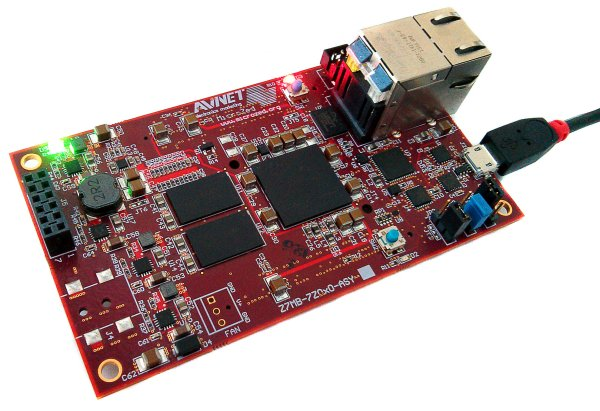

Power-On
========

Microzed takes the power from the mini-USB connector *J2*. The board is not shipped with an external power adapter.

To power-on the board, just connect the mini-USB from PC to Microzed connector.
On connector *J2* you can also have the serial console, so, during your daily development use,
you would just connect your workstation to the board using the mini-USB.
